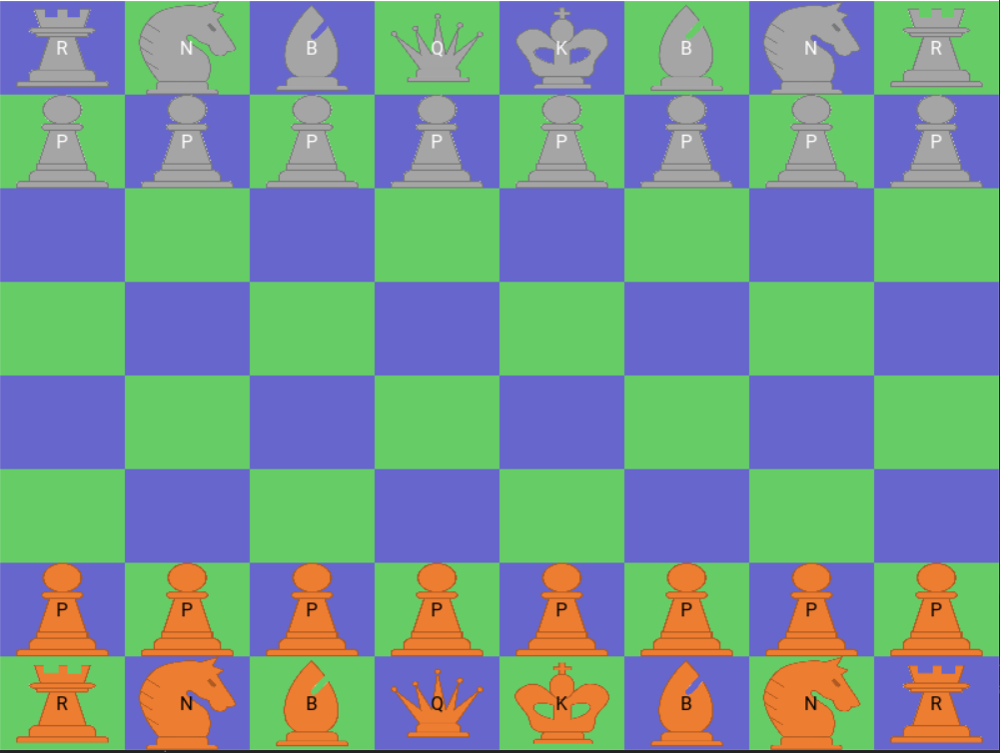

## PyAlapin, your customized chesse engine
Is it the best, most efficient and state of the art chess engine ? I'm pretty sure not.

However, driven by passion and madness, I have developed my own chess game in Python.
For your pretty eyes and your devilish smile, I share it with you. But only with you.

Special thanks and dedication to LeMerluche, crushing its opponents on chess.com ❤️

## How to play with interface
```python
from interface.interface import MyApp

if __name__ == '__main__':
    MyApp().run()

```



## How to play with Python commands

```python
import sys
sys.path.append("python/")
import python.engine as engine

game = engine.engine.Game()
game.move_from_coordinates(game.player1, 1, 4, 3, 4)
game.move_from_coordinates(game.player2, 6, 0, 5, 0)
```
