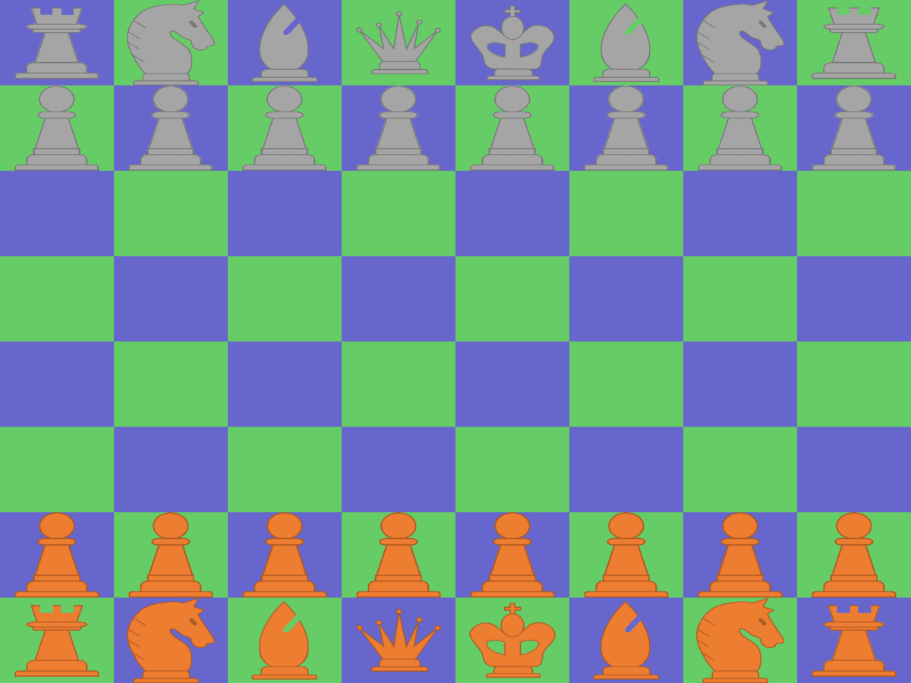
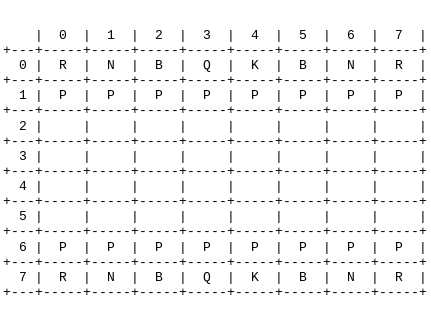

# PyAlapin, your customized chess engine
Is it the best, most efficient and state of the art chess engine ? I'm pretty sure not.

However, driven by passion and madness, I have developed my own chess game in Python.
For your pretty eyes and your devilish smile, I share it with you. But only with you.

Special thanks and dedication to LeMerluche, crushing its opponents on chess.com with alapin openings ❤️

## How to install
Simply use:
```bash
pip install pyalapin
```
You only need [numpy](https://numpy.org/) to play with with terminal interface and with Python.
You will need [kivy](https://kivy.org/) to play with the interface.

## How to play with interface
```python
from pyalapin.interface import ChessApp

if __name__ == '__main__':
    ChessApp(
        play_with_ai=False # Set to True if you want to play agains AI
    ).run()

```



You can play against Stockfish by installing the official [Python interface](https://github.com/zhelyabuzhsky/stockfish).
```python
from pyalapin.player.player import Player
from pyalapin.player.stockfish_player import StockfishPlayer
from pyalapin.interface import ChessApp

sfp = StockfishPlayer(path_to_stockfish_engine, white_side=False)
app = ChessApp(w_player=Player(True), b_player=sfp, play_with_ai=True)
app.run()
```

## How to play with Python commands



```python
from pyalapin.engine import ChessGame

game = ChessGame(
    automatic_draw=True, # Set to True if you want
                         # to have each turn drawn in terminal
    ai=False, # set to True if you want to play agains AI
    save_pgn=False # set to True if you want to
                   # save moves as PGN
)
game.move_from_coordinates(game.player1, 1, 4, 3, 4)
game.move_from_coordinates(game.player2, 6, 4, 4, 4)
game.move_from_coordinates(game.player1, 0, 5, 3, 2)
game.move_from_coordinates(game.player2, 6, 3, 5, 4)
game.move_from_coordinates(game.player1, 0, 3, 2, 5)
game.move_from_coordinates(game.player2, 6, 2, 4, 2)
game.move_from_coordinates(game.player2, 2, 5, 6, 5)
```
There are colors in the command line not showing here in the GIF, though...

## How to change interface colors

With line command you can create new illustrations by specifying the RGB colors you want. You can specify the colors of the cells and of the pieces (outer and inner colors).
Use the following command with the colors you want:
```bash
python interface/colorize.py -ccb 0 191 255 -ccw 207 185 151 -ibp 109 7 26 -obp 0 0 0 -iwp 200 200 200 -owp 255 255 255
```
Arguments are:
- -ccb/--color_cell_black: RGB, default 0, 191, 255
- -ccw/--color_cell_white: RGB, default 207, 185, 151
- -ibp/--inner_black_piece: RGB, default 109, 7, 26
- -obp/--outer_black_piece: RGB, default 0, 0, 0
- -iwp/--inner_white_piece: RGB, default 200, 200, 200
- -owp/--outer_white_piece: RGB, default 255, 255, 255

The command creates (or replaces) the illustrations that are in the temp_images/ folder. If the folder exists, the interface uses theses illustrations. Destroy it to come back to standard illustrations.
